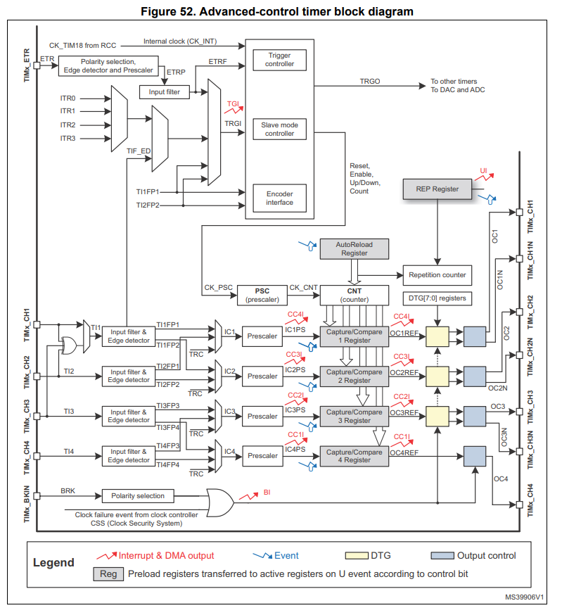

STM32的定时器设计介绍
===============================

以 `STM32F103RC`_ 为例,ST定义了三种定时器类型。

.. _STM32F103RC: https://www.st.com/resource/en/reference_manual/cd00171190-stm32f101xx-stm32f102xx-stm32f103xx-stm32f105xx-and-stm32f107xx-advanced-armbased-32bit-mcus-stmicroelectronics.pdf

- Basic timers(基础定时器)
- General-purpose timers(通用目的定时器)
- Advanced-control timers(增强型定时器)

Basic timers(基础定时器)
---------------------------------------

1. Feature
>>>>>>>>>>>>>>>>>>>
- 16-bit auto-reload upcounter
- 16-bit 分频器
- 与DAC共享部分电路以驱动DAC
- 计数超时会产生DMA Request/Interrupt

2. Block Diagram
>>>>>>>>>>>>>>>>>>>
|Block Diagram| 

.. |Block Diagram| image:: BasicTimer.PNG

基础定时器提供了基本的功能，外部时钟在分频之后进入到基础定时器中，当基础定时器的CNT计数达到Auto-reload Register数值的时候
产生中断/DMA请求。基础定时器仅支持上升计数模式，当达到ARR的时候自动清零。

3. Register Design
>>>>>>>>>>>>>>>>>>>
- TIMx_CR1
    + ARPE: 选择当溢出事件产生是否重新装载ARR的值
    + OPM:  是否开启one-pulse模式，决定溢出事件产生后是否停止计数
    + URS:  选择触发interrupt/DMA request的事件，是仅overflow/underflow事件还是包含其他
    + UDIS: interrupt/DMA request事件的使能位
    + CEN:  计数使能
- TIMx_CR2
    + MMS:  当基础定时器作为主定时器为从模块提供时钟的时候，选择时钟事件，是Reset事件或者是CNT_EN事件或者是分频器update事件
- TIMx_DIER
    + UDE/UIE: interrupt以及DMA的使能
- TIMx_SR
    + UIF: 中断标志位
- TIMx_EGR
    + UG:清理CNT的数据，重新计数
- TIMx_CNT
    + CNT:计数值
- TIMx_PSC
    + PSC[15:0]: 分频值
- TIMx_ARR
    + ARR: 预加载值

4. Application
>>>>>>>>>>>>>>>>>>>

- 提供固定事件的中断信号
- 为DAC/ADC等其他模块提供工作时钟

5. 优势与我们可借鉴的方面
>>>>>>>>>>>>>>>>>>>>>>>>>>>>>>>>

- 此模块比较简单，仅支持上升计数模式，仅有一个比较值，产生固定时间的计数信号，可以把这种简单的基础计数器模块当作一个其他设备的时钟分频器。
- 我们可以借鉴的点是，是否可以设计这种基础计数器为其他的外设提供更加灵活的时钟？
- 之前ADC的模块存在一个问题，ADC的输入时钟在BL602设计里面只支持1 4 8 16 256 等分频选项，导致了如果输入的时钟不是由专门的PLL时钟电路产生的2.048M时钟，那么mic应用会拿不到标准的8K采样率，因为ADC会做一个64，128，或256次平均，相当于分频，使得最终的ADC时钟取不到整数，如果TIMER模块支持Basic Timer 并且这个Basic Timer可以成为ADC的输入时钟，那么就可以解决这个问题。
- 如果Basic Timer可以为DAC提供时钟，那么DAC就可以灵活的解调各种采样率的音频。

General-purpose timers(通用目的定时器)
-----------------------------------------

1. Feature
>>>>>>>>>>>>>>>>>>>
- 16-bit up,down, auto-reload upcounter
- 16-bit 分频器
- 四路比较通道作为 1 输入捕获 2 输出比较 3 PWM生成 4 One-pulse mode output
- 可编程死区补偿输出
- 与外部定时器或内部定时器同步工作
- 多种事件产生DMA request/Interrupt
2. Block Diagram
>>>>>>>>>>>>>>>>>>>
|Advanced-control timer Block Diagram| 

在原有Basic Timer的基础上增加了四路比较器的功能，支持输入捕获，同时增加了多种计数模式。

3. Function
>>>>>>>>>>>>>>>>>

多种计数模式
::::::::::::::::::
- 上升计数模式：计数器从0计数到ARR,然后restat归零，产生overflow事件。软件置位UG(重新计数控制)也会触发中断。
- 下降计数模式：计数器从ARR计数到0，然后重新装填ARR,产生underflow事件。
- 中间对齐模式(Center-aligned mode):计数器从0增计数到ARR-1，产生overflow事件后，从ARR减计数到1，产生underflow事件，最后归0循环
- 重复计数模式(Repetition counter):多个overflow/underflow事件才会产生一个UEV事件，以上升计数为例，原先0->ARR就会产生一次中断，当RCR=1的时候，0->ARR重复两次才会产生一次中断

输入捕获模式
:::::::::::::::::::::::::::::

|input Capture Block Diagram| 

.. |input Capture Block Diagram| image:: inputCapture.jpg

由图可知，外部的信号先进入滤波器中，然后经过边沿检测器，决定检测上升/下降沿。最后经过一个分频器进入到输入捕获定时器中，此时出现一个捕获信号，记录当前的CNT值完成捕获。

在输入捕获模式中，CCRx寄存器的作用是锁存当前计数值当捕获到外部沿信号(In Input capture mode, the Capture/Compare Registers (TIMx_CCRx) are used to latch the
value of the counter after a transition detected by the corresponding ICx signal),当捕获时间发生，CCXIF标志位置位，产生中断/DMA请求，如果捕获发生但是CCXIF还是置位的状态，那么过捕获标志位置位CCxOF。CCIF可以软件置零，或者在用户读取CCRx的时候硬件清零。

输入捕获的工作顺序

|input Capture Work process| 

.. |input Capture Work process| image:: 捕获过程.png

PWM input mode
:::::::::::::::::::::::::

检测PWM波形的占空比，是输入捕获模式的具体应用，使用两路输入捕获，一个设定为上升沿一个为下降沿，两个捕获值配合定时器频率即可算出占空比与周期

Forced output mode / Output compare mode / PWM mode
::::::::::::::::::::::::::::::::::::::::::::::::::::

定时器计数值与CCRx对比产生对应的对比输出。
BL602的PWM模块以及现有的Timer模块已经做的足够好，所以参考设计意义不大。

Advanced-control timers(增强型定时器)
-----------------------------------------

增强型定时器在通用定时器的基础上增加了

- 互补输出和死区插入
- Break Function
- Encoder interface mode
- Interfacing with Hall sensors
- TIMx and external trigger synchronization
- Timer synchronization

互补输出和死区插入(Complementary outputs and dead-time insertion)
>>>>>>>>>>>>>>>>>>>>>>>>>>>>>>>>>>>>>>>>>>>>>>>>>>>>>>>>>>>>>>>>>>

- 互补输出和死区的应用场合
    互补输出提供了两个互补的PWM驱动信号，在1路为高电平的时候2路为低电平，以此类推。适用于有两个设备交替工作的情况，例如BLDC电机或者H桥。此时修改占空比也就是修改两个设备各自在一个总周期的工作时长。
    后级设备有时候会出现关闭不及时的问题，也就是当控制器给出低电平信号的时候往往后级设备不会立刻停止工作，而此时另一个设备又获取到了高电平信号开始工作，此时会出现一段时间两个设备同时工作的现象
    这样的现象会存在损坏设备的风险，所以需要插入死区。换言之，两个PWM不是完全互补的，存在两个信号同时为低的时刻，见下图delay含义。

|互补输出与死区意义| 

.. |互补输出与死区意义| image:: 互补输出与死区.png

|互补输出与死区意义2| 

.. |互补输出与死区意义2| image:: 互补输出二.png

见STM32F103RC的um可以参考互补输出的死区设计，增补在BL602 PWM模块中。

break Function
>>>>>>>>>>>>>>>>>>>>>>>>>>>>>>>>>>>>>>>>>>>>>>>>>>>>>>>>>>>>>>>>>>
TODO

Encoder interface mode
>>>>>>>>>>>>>>>>>>>>>>>>>>>>>>>>>>>>>>>>>>>>>>>>>>>>>>>>>>>>>>>>>>
类似已有设计Qdec,提供编码器的应用接口

Interfacing with Hall sensors
>>>>>>>>>>>>>>>>>>>>>>>>>>>>>>>>>>>>>>>>>>>>>>>>>>>>>>>>>>>>>>>>>>
霍尔元件的接口定时器设计

TIMx and external trigger synchronization / Timer synchronization
::::::::::::::::::::::::::::::::::::::::::::::::::::::::::::::::::::::
定时器同步问题