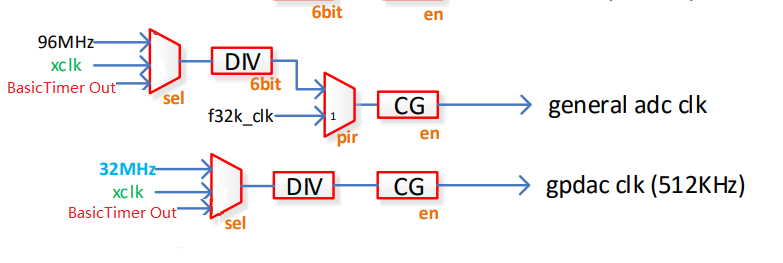
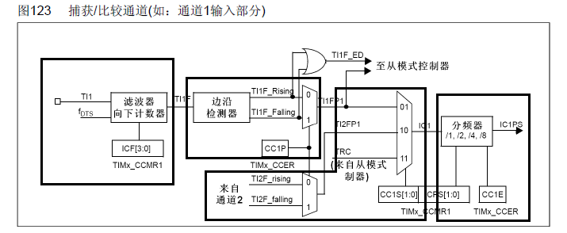
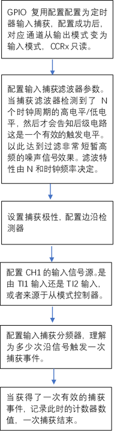
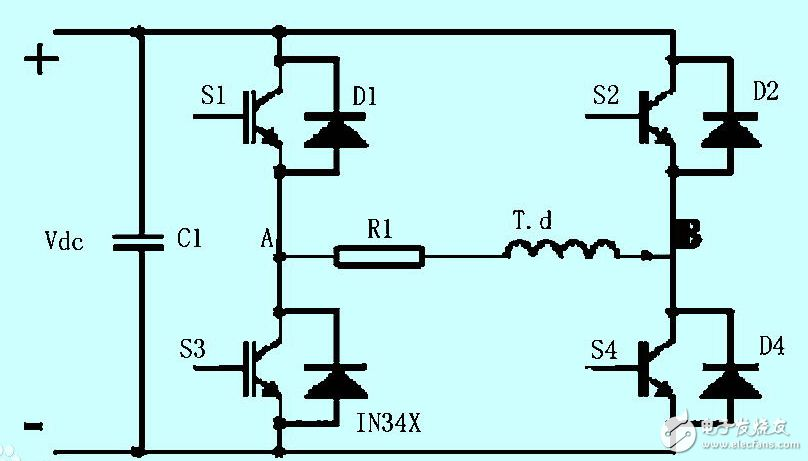

定时器模块设计建议
===========================

1. 基础定时器提供灵活的时钟给其他外设
-------------------------------------------

想法
>>>>>>>>>>>

参考 STM32的Baisc Timer的设计,Basic Timer提供一个对比通道ARR计数值从0计数到ARR后会产生一个UEV，驱动interrupt/DMA事件，之后清零计数值重新开始计数
Basic Timer的基础源时钟可灵活选择，可以将Basic Timer经过ARR分频后的驱动信号作为其他外设的输入时钟，从而达到非常灵活的外设时钟配置。这样的设计在低速外设场合，个人认为尤其有用。

应用
>>>>>>>

ADC/DAC的输入时钟选择增加一个由Basic Clock输出选项。
|时钟树增补| 

当ADC/DAC应用在音频领域的时候，经典的调制解调速率是8kHz、11.025kHz、22.05kHz、16kHz、37.8kHz、44.1kHz、48kHz

当我们需要ADC的采样频率是8K的时候，如果用过去的时钟树那有如下几种方式
(I) adc内部仅支持1，4，8，12，16，20，24，32分频枚举。如果选择为32分频，那么要求输入时钟源为256k
96M / 375 分频 = 256kHZ
但是遗憾的是对96MHZ最多只能进行64分频，因为分频器只支持6个BIT。
所以如果选择96M作为时钟源，不能得到8K的时钟输入
(II) 选择为XCLK作为时钟输入，XCLK 支持24/32/38.4/40MHz四种数值选择，并且由硬件决定晶振频率数值
选择24M左右源端输入，用最大的分频64，得到的输入时钟为
24M/64=375K,依旧比256K大的多。

ADC模块内部由OSR,但是OSR的仅支持64 128 256三种枚举。这样的分频使得获得整数频率的可能性很小。

ChipTest/ADC/adc_mic_basic.c里面给出了一种配置方法
96M / 2+1 = 32M 源端输入32MHZ时钟
32M / 16 = 2M 经过ADC内部16分频得到2MHZ工作频率
为了达到16BIT的精度使用了256 OSR
2M /256 = 7.8125KHZ
近似得到了7.8125khz的频率，但是得不到标准的8K频率。

究其原因在于96MHZ这个时钟不能被256/128整除，以及对96MHZ的任意分频仅在0-64太小了，使得输入的时钟可配置的范围小。

所以针对上述的实际需求，由两种方法可以改善这个问题
:::::::::::::::::::::::::::::::::::::::::::::::::::

1 增大源端分频器的分频范围从0-64 扩大到0-65535
2 增补Basic Timer作为ADC/DAC的输入时钟。这样就可以灵活的给外设各种各样的频率.

2. 增加定时器捕获功能
--------------------------
想法
>>>>>>>>>>>
外部存在一个方波信号，其频率储存着某个物理量信息，例如转速。定时器应该可以测量这个方波信号的频率信息。
使用GPIO的外部中断与定时器协调工作可以完成这样的功能，但是对于资源消耗较大，最好是有对应的硬件设备直接支持此功能。

参考设计
>>>>>>>>>>>
见STM32定时器设计介绍--输入捕获模式
|input Capture Block Diagram| 

外部输入先进入【捕获滤波器】当触发电平保持N个有效时钟周期后，通知后级出现触发电平。
后级进入【边沿检测器】后再进入【分频器】触发一个信号，记录此时的计数值CNT放入CCRx比较寄存器中，一次捕获结束。

|input Capture Work process| 

应用
>>>>>>>

许多传感器的输出都是频率输出，例如部分压力传感器，会将压力值的大小调制成频率信号输出。

调频信号往往会是高频的信号，如果用GPIO外部中断+定时器的方法会占大量资源，所以设计捕获非常有必要。

调频信号对噪声的抑制能力强，抗干扰能力强，。

3. 对PWM模块增补互补输出与死区插入功能
------------------------------------------
想法
>>>>>>>>>>>
PWM模块是否可以支持互补输出的工作方法，并且加入死区控制，应用在电机控制 逆变器等领域。
|互补输出与死区意义| 

.. |互补输出与死区意义| image:: 互补输出与死区.png

如图所示，OCx和OCxN是一对互补的PWM信号，OCx与OCxN极性相反，死区就是OCx与OCxN同时为低的delay时间区域。
此时间区域是用来避免设备收到低电平信号后没有立刻关断，导致有一小段时间两个设备均打开的现象而设计的。

应用
>>>>>>>
典型的应用在于类似逆变器的应用
|逆变器应用| 

如图，负载T.d，当S1 S3 S2 S4接入两对互补输出的PWM。
当S1 S4导通S3 S2关断的时候，负载获得正电压，S3和S2导通，S1 S4关断的时候，负载获得负电压。

显然 S1 S2 不可以同时打开，否则会短路烧坏管子。因此S1-S3 ， S2-S4 可以由互补的PWM来控制。

死区的意义在于，当S1导通,S3截止，下一个时钟周期S3导通 S1截止，考虑到S1由导通到截止需要一定的时间，会出现短暂时间S1 S3都导通的情况
于是加入死区概念，S1 S3都有一段时间都截止。

同样的应用可以用于驱动三相交流电机，使用六路互补PWM输出，类似完成三相逆变的过程。

因此如果想我们的MCU驱动高级的三相交流电电机，最好可以支持可插入死区的互补PWM输出。

4. 是否可以提供下降计数模式/中间对其模式/重复计数模式等
--------------------------------------------------------
想法
>>>>>>>>>>>

是否可以支持更加丰富的计数模式

应用
>>>>>>>
各种丰富的计数模式